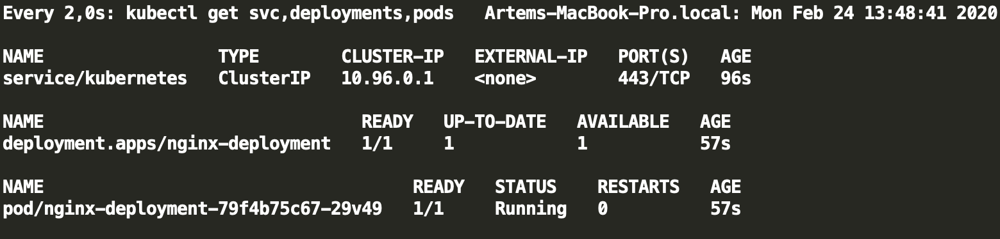
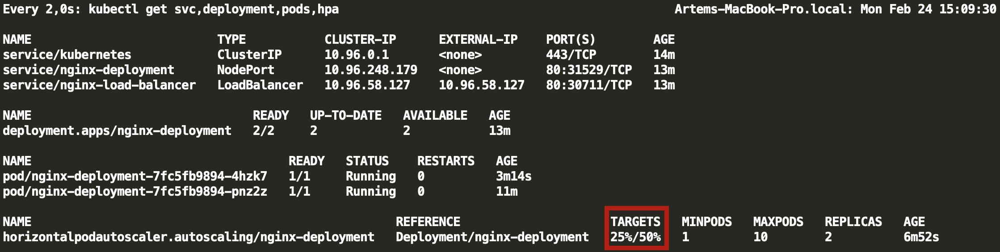

## Install minikube

To install minikube, follow the instructions [here](https://kubernetes.io/docs/tasks/tools/install-minikube/).

Additionally, we will need to activate the metrics-server.

`minikube addons enable metrics-server`

## Initialize a watch mode

In a separate terminal window apply the following command:

`watch kubectl get svc,deployment,pods,hpa`

Now you should be able to controll the current status of your deployment.

## Deploy a basic app

Take a look at a basic manifest in the ./01_basic folder of this project. The basic type of resource, the deployment, 
is defined there. Open a new terminal window. We will run several commands to get us up and running.  

### Apply yaml

You can spin up a cluster by running the following command:

`kubectl apply -f ./01_basic/deployment.yaml`

So looks the result:

### Expose deployment (create service)

Now we can create a service through which our nginx instance will be available for the world 
(for now without load balancer).

`kubectl expose deployment nginx-deployment --type=NodePort`

### Get the url

To get the actual url, run the following:

`minikube service nginx-deployment --url`

Now you can open our nginx server in your browser.

## Scaling

### Scaling manually

The simpliest way to scale up is to increase the replica set manually as following:

`kubectl scale --replicas=4 deployment/nginx-deployment`

Now we need to define a Load Balancer so we could access our replica set as a service:

`kubectl expose deployment nginx-deployment --type=LoadBalancer --port=80 --target-port=80 --name nginx-load-balancer`
`kubectl describe service nginx-load-balancer`

Services of type LoadBalancer can be exposed via the `minikube tunnel` command on your local machine.
It will run in a separate terminal until Ctrl-C is hit.

So looks the result:

### Autoscaling

#### Configure

The scaling is closely related to the resource limit. Let's set one as following:

`kubectl set resources deployment/nginx-deployment -c=nginx --limits=cpu=100m,memory=64Mi`

As the limits are set, we can now define a autoscaling policy:

`kubectl autoscale deployment nginx-deployment --cpu-percent=50 --min=1 --max=10`

#### Load test

**With Apache Benchmarking**

Now let's make the same load test to see how many requests we're giong to process, 
and how the k8s will handle the increased load with autoscaling.

With Apache Bench we now make:
* 1.000.000 requests
* with 100 concurent threads

`ab -n 1000000 -c 100 http://<service-ip>/`

**With a container**

Run:
 
`kubectl run --generator=run-pod/v1 -it --rm load-generator --image=busybox /bin/sh`

In the opened promt enter the following: 

`while true; do wget -q -O- http://nginx-deployment.default.svc.cluster.local; done`

Unlike ab, this will run an infinite loop until you break it.

With either way you should see an increased load along with a number of new pods starting up to deal with it.

You can further inspect your autoscaler with the following commands:

`kubectl get hpa`
`kubectl delete hpa nginx-deployment`

You can also allpy custom limits on resources. Take a look at the manifest `./02_autoscaling/hpa-v2.yaml` for how
you can set limits on the ammount of incomming requests per pod. 

### Cleaning up resources

Cleaning up all the resources we've created so far:

`kubectl delete --all deployment,svc,pods,hpa`

Cleaning up orphaned routes:

If the minikube tunnel shuts down in an abrupt manner, it may leave orphaned network 
routes on your system. If this happens, the ~/.minikube/tunnels.json file will 
contain an entry for that tunnel. To remove orphaned routes, run:

`minikube tunnel --cleanup`

## Rolling updates

### Recreate the setup

Run the basic deployment again: 

`kubectl apply -f ./01_Basic/deployment.yaml`

Set the number of replicas to 10:

`kubectl scale --replicas=10 deployment/nginx-deployment`

And expose a service:

`kubectl expose deployment nginx-deployment --type=LoadBalancer --port=80 --target-port=80 --name nginx-load-balancer`

You should see the following status in your watch mode:

### Change an image

Let's change the image to `nginx:latest` while the cluster is running:

`kubectl set image deployment/nginx-deployment nginx=nginx:latest`

The rolling update spin up, but without any downtime on the cluster:

### Rollback

Now you can access the rollout history:

`kubectl rollout history deployment/nginx-deployment`,

iterate over rollout revisions:

`kubectl rollout history deployment/nginx-deployment --revision=2`,

and, most importantly, roll back:

`kubectl rollout undo deployment.v1.apps/nginx-deployment`.

## Health checks

By default, Kubernetes starts to send traffic to a pod when all the containers inside the pod start, and restarts 
containers when they crash. While this can be “good enough” when you are starting out, you can make your deployments 
more robust by creating custom health checks.

Kubernetes gives you two types of health checks, and it is important to understand the differences between the two, 
and their uses.
* Readiness probes are designed to let Kubernetes know when your app is ready to serve traffic. Kubernetes makes sure 
the readiness probe passes before allowing a service to send traffic to the pod. If a readiness probe starts to fail, 
Kubernetes stops sending traffic to the pod until it passes.
* Liveness probes let Kubernetes know if your app is alive or dead. If you app is alive, then Kubernetes leaves it alone. 
If your app is dead, Kubernetes removes the Pod and starts a new one to replace it.

There are three types of probes: HTTP, Command, and TCP. You can use any of them for liveness and readiness checks.

Here is a simpliest example for our app under `./03_health_checks/`
